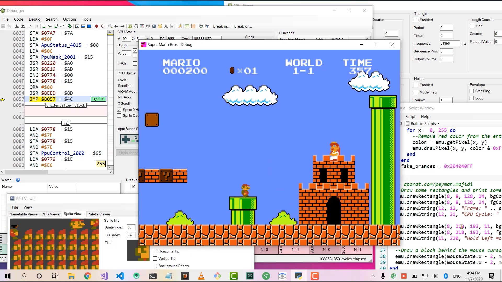

Super Mario Bros Short Story
=============

An attempt to recreate the first level of Super Mario Bros.

CONTROLS: 

Arrow keys for direction

'a' for jump

's' for action (fireball, run)

DEPENDENCIES:

Pygame 1.9.1 (Python 2)

Pygame 1.9.2 (Python 3) - a little trickier to get going.

To install dependencies for Python 2.x:

	pip install -r requirements.txt

VIDEO DEMO:

https://www.aparat.com/v/4ENI8
 
By Peyman Majidi